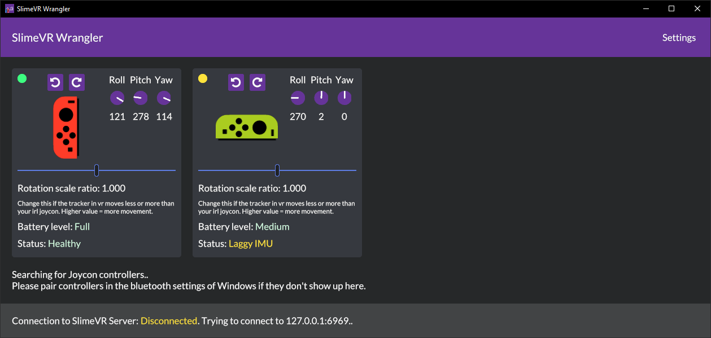

# SlimeVR Wrangler

Use joy-Con's (+) as SlimeVR trackers, enabling you to make a full body system with your existing devices. Combine with DIY SlimeVR trackers, or phones using owoTrack.

(+) More devices planned to be added.

## Setup
You need bluetooth on your computer.
* Download and set up [SlimeVR](https://docs.slimevr.dev/slimevr-setup.html)
* Download [SlimeVR Wrangler](https://github.com/carl-anders/slimevr-wrangler/releases/latest/download/slimevr-wrangler.exe)
* Start both the SlimeVR server and SlimeVR Wrangler
* Connect your Joy-Con trackers to the computer ([Guide for Windows](https://www.digitaltrends.com/gaming/how-to-connect-a-nintendo-switch-controller-to-a-pc/))
* Make sure the SlimeVR server is running, then press "Search for Joycons" inside SlimeVR Wrangler
* The Joy-Con should show up in the window!
* Follow the SlimeVR documentation to set up the new tracker, with the direction below:

### Left Joy-Con

The rail that attaches to the switch device should be pointed toward your feet, with the joystick pointing forward.

In SlimeVR server, set direction to "forward".

You can also play around with different ways of mounting the Joy-Con, with different directions in the SlimeVR server.

### Right Joy-Con

Same as left Joy-Con, but with the joystick pointing inward. Note: I might change this in future versions to be same as left stick.

## Issues

Many! This is a **alpha** version, and there's no guarantees about anything.

* Rotation tracking is bad! - Yup, sorry. In the future there will be settings to help fine tune the tracking. I suggest binding a button to reset.
* It stops tracking when I turn around! - Bluetooth does not have a good range, you might have better luck with a different bluetooth adapter.
* It crashes when I reconnect the Joy-Con! - Yeah, working on fixing this. You'll just have to restart the SlimeVR Wrangler program.
* Probably more.

### My Joy-Con's are connected in the Windows bluetooth menu but won't show up!

This is a problem that might be related to a newer Windows update. Try this, and it might fix it:
* Go to the Windows Setting app -> Bluetooth & other devices.
* Press on the Joy-Con that won't connect. Press "Remove device".
* Pair the device again. It should now show up.

# License
The application code is licensed under GPLv3 due to a GPL dependency. The `slimevr_codec` crate is dually licensed under MIT and Apache 2.0, *not* GPLv3.

If you contribute to this repository, you also agree to license your contributions with MIT License & Apache License, Version 2.0. This is because I might eventually make the application code MIT/Apache 2.0 licensed in the future.
